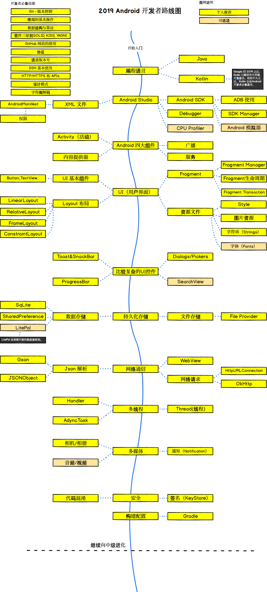

# android-developer-roadmap-cn
在 2020 成为一名 Android 开发者的路线图。🚀

## 前言

本项目是受[developer-roadmap](https://github.com/kamranahmedse/developer-roadmap)启发，旨在为 Android 开发者或初学者提供一份可以参考的完整路线图。

## Android 开发路线图

## 贡献👏

如果你认为路线图缺少某些知识点或者有更好的想法，欢迎提 issue 或者直接提 pr，我会持续完善维护本项目。此外，也欢迎给本项目一个 star🌟 。

- 关于[balsamiq](https://balsamiq.com/)

## License

